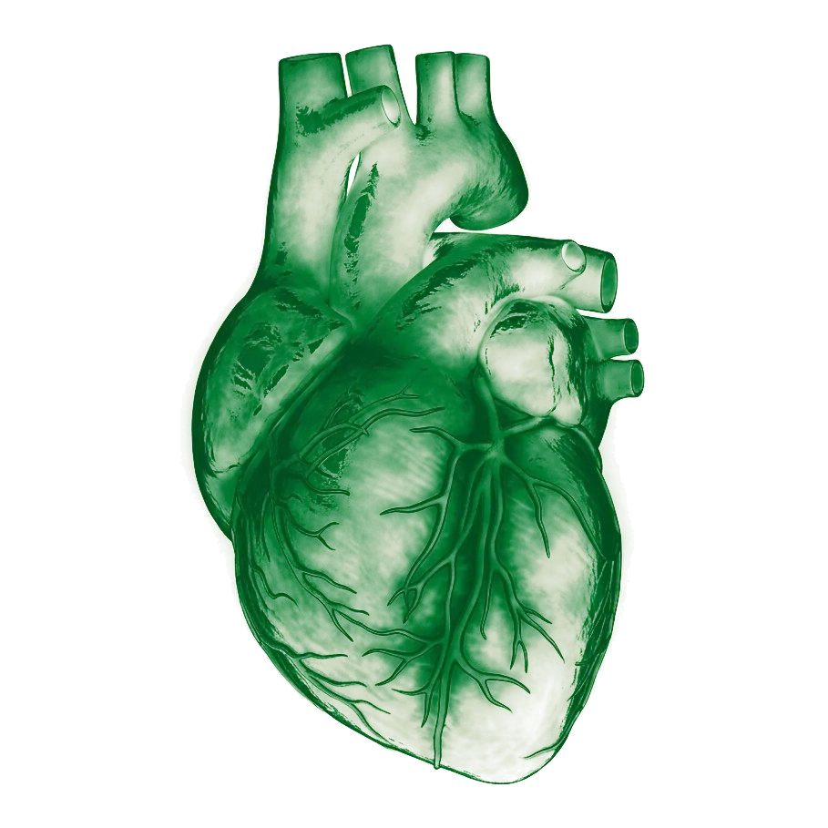

# GSAP 3D Organ Slideshow Implementation Plan

## 1. System Overview and Objective

This plan defines the architecture for the pinned 3D morphing scroll slideshow in the organ donor registry portal.
The timeline executes within `#organ-slideshow-section`.
The animation scrubs across user scroll with a 60 frames per second performance target.
The system animates six vital organs in sequence: Heart, Kidneys, Lungs, Liver, Corneas, and Tissue.
All visual updates use hardware-accelerated GPU transforms and opacity changes only.

## 2. Architecture and Design Decisions

- `D1` (Pinned Stage Architecture): ScrollTrigger pins `#organ-slideshow-section` across 350vh of scroll travel.
The pin configuration uses `pin: true`, `scrub: 1`, and `anticipatePin: 1`.
The stage locks the viewport while the user scrubs through the six specimens.
- `D2` (GPU Transform Isolation): All animations restrict property updates to `x`, `y`, `z`, `rotationX`, `rotationY`, `scale`, and `opacity`.
The implementation never animates layout geometry such as width, height, margin, or padding.
The stage layers apply `transform-style: preserve-3d` and `will-change: transform, opacity`.
- `D3` (Six Specimen Progression): The progression presents six clinical slides in strict anatomical order: Heart, Kidneys, Lungs, Liver, Corneas, and Tissue.
Each slide contains a 3D specimen stage and a clinical telemetry heads up display (HUD).
- `D4` (Telemetry HUD Synchronization): Clinical telemetry panels slide in from the right edge with a 60 millisecond scrub offset.
HUD copy communicates lives saved, conditions treated, and retrieval mechanics.
- `D5` (Navigation and Progress Telemetry): A progress fill bar expands across the top of the pinned stage.
A step indicator pill bar highlights the active organ index from 1 to 6.
Both indicators update synchronously with the ScrollTrigger scrub playhead.
- `D6` (Reduced Motion Compliance): The module queries the `prefers-reduced-motion` media condition.
When active, the engine eliminates Z-depth travel and rotational perspective, providing clean linear cross-fades.
- `D7` (Module Lifecycle and Cleanup): The factory function wraps all timelines and triggers inside `gsap.context`.
The function returns explicit lifecycle hooks for `kill`, `revert`, and programmatic navigation.

## 3. Motion Doctrine and Easing Specifications

The implementation enforces the easing and timing rules from `motion-doctrine.md`.

- `E1` (Cinematic Luxury): `cubic-bezier(0.16, 1, 0.3, 1)` governs camera perspective shifts and HUD spatial movements.
This curve delivers high initial velocity with smooth clinical deceleration.
- `E2` (Specimen Settling): Damped spring dynamics govern incoming specimen landing and scale adjustments.
This curve simulates physical biological mass and tension without visual ringing.
- `E3` (Telemetry Fade): `cubic-bezier(0.25, 1, 0.5, 1)` governs opacity transitions for numerical readouts and condition badges.
- `S1` (Pinned Travel Distance): Total scroll distance equals 350vh (`end: "+=350%"`).
- `S2` (Scrub Damping): ScrollTrigger applies a 1.0 second damping scrub window (`scrub: 1`).
- `S4` (Macro Transitions): Five transition windows distribute evenly across the total timeline duration.
- `S5` (Release Gate): The full six specimen sequence completes before releasing scroll to the donor registration studio.

## 4. Choreography and Timeline Sequencing Breakdown

The master timeline operates with a normalized duration of 5.0 time units.
Each organ transition receives 1.0 unit of timeline duration.

### Progression Map

1. Slide 0: Heart (Normalized timeline time 0.0)
2. Transition 1: Heart exits, Kidneys enter (Time 0.0 to 1.0)
3. Transition 2: Kidneys exit, Lungs enter (Time 1.0 to 2.0)
4. Transition 3: Lungs exit, Liver enter (Time 2.0 to 3.0)
5. Transition 4: Liver exits, Corneas enter (Time 3.0 to 4.0)
6. Transition 5: Corneas exit, Tissue enters (Time 4.0 to 5.0)

### Single Transition Choreography Cycle

- `C1` (Organ Sequence): Active specimen recedes into background space while next specimen approaches foreground.
- `C2` (Active Organ Exit): Active specimen scales from 1.00 to 1.08.
Specimen rotates from -12 degrees to +8 degrees on the Y axis and -4 degrees on the X axis.
Specimen recedes along the Z axis from 0px to -350px.
Specimen opacity fades from 1.00 to 0.00.
Active HUD panel translates -30px along the X axis and fades out.
- `C3` (Incoming Organ Entrance): Next specimen begins at Z position +300px with opacity 0.00.
Specimen scales down from 1.15 to 1.00.
Specimen rotates from -10 degrees to 0 degrees on the Y axis.
Specimen approaches focal plane at Z position 0px with opacity 1.00.
Entrance uses `E2` specimen settling easing.
- `C4` (Telemetry HUD Slide): Incoming HUD panel starts at X position +40px with opacity 0.00.
HUD translates to X position 0px and fades to opacity 1.00 with a 0.06 unit offset relative to specimen arrival.
- `C5` (Vascular Illumination): 24K gold and clinical green vascular glow pulse peaks as specimen reaches Z position 0px.
- `C6` (Overlap and Anticipation): Incoming specimen begins forward travel at 70 percent of the active exit cycle.
The 30 percent overlap preserves continuous visual motion without empty frames.

## 5. DOM Selector Contract and Markup Structure

The timeline wires to the following DOM structure:

```html
<section id="organ-slideshow-section" class="organ-slideshow-section">
  <div class="organ-slideshow-sticky">
    <div class="organ-telemetry-header">
      <div class="organ-progress-bar-wrap">
        <div class="organ-progress-fill" aria-hidden="true"></div>
      </div>
      <div class="organ-step-pills" role="tablist" aria-label="Organ slides">
        <button class="organ-step-pill active" data-index="0" role="tab">01 Heart</button>
        <button class="organ-step-pill" data-index="1" role="tab">02 Kidneys</button>
        <button class="organ-step-pill" data-index="2" role="tab">03 Lungs</button>
        <button class="organ-step-pill" data-index="3" role="tab">04 Liver</button>
        <button class="organ-step-pill" data-index="4" role="tab">05 Corneas</button>
        <button class="organ-step-pill" data-index="5" role="tab">06 Tissue</button>
      </div>
    </div>

    <div class="organ-stage-viewport">
      <div class="organ-slides-container">
        <!-- Slide 0: Heart -->
        <article class="organ-slide" data-organ="Heart" data-index="0">
          <div class="organ-specimen-stage">
            <div class="organ-specimen-3d">
              
              <div class="vascular-glow" aria-hidden="true"></div>
            </div>
          </div>
          <div class="organ-hud-panel">
            <span class="hud-tag">01 / 06 · Vital Organ</span>
            <h2 class="hud-title">Heart</h2>
            <div class="hud-saves"><strong>1</strong> life saved</div>
            <p class="hud-desc">A donated heart gives one person with end-stage heart failure a second life.</p>
            <div class="hud-conditions">
              <span class="hud-chip">End-stage cardiomyopathy</span>
              <span class="hud-chip">Severe coronary disease</span>
              <span class="hud-chip">Congenital heart defects</span>
            </div>
          </div>
        </article>
        <!-- Additional slides: Kidneys, Lungs, Liver, Corneas, Tissue -->
      </div>
    </div>
  </div>
</section>
```

## 6. Performance and Anti-Slop Enforcement

- `A1` (No Bouncy Text Overshoot): HUD typography elements use monotonic deceleration curves.
Text elements never bounce or overshoot spatial coordinates.
- `A2` (No Linear Spatial Interpolation): Organ transitions use cubic curves and damped physics.
Linear movement curves are forbidden.
- `A3` (No Generic Purple Haze): Luminescent highlights use clinical green `#008037` and 24K vascular gold `#c9a23b`.
Purple and neon violet tones are forbidden.
- `A4` (Preserve 60 FPS GPU Transforms): Only `transform` and `opacity` properties receive tweens.
All layers execute with `force3D: true` to guarantee separate GPU compositing layers.
- `A5` (No Layout Shifts): Width, height, margin, and padding remain immutable during animation.
- `A6` (Respect Reduced Motion): Reduced motion turns off Z-depth translations, rotational tilts, and spring oscillation.
The slideshow falls back to accessible opacity fades.

## 7. Exportable API Contract and Integration Guide

The implementation resides in `gsap-timeline.js`.
It exports `createOrgan3DSlideshowTimeline(gsap, ScrollTrigger, options)`.

### Function Signature

```javascript
import gsap from 'gsap';
import { ScrollTrigger } from 'gsap/ScrollTrigger';
import { createOrgan3DSlideshowTimeline } from './gsap-timeline.js';

gsap.registerPlugin(ScrollTrigger);

const controller = createOrgan3DSlideshowTimeline(gsap, ScrollTrigger, {
  sectionSelector: '#organ-slideshow-section',
  pin: true,
  scrub: 1,
  anticipatePin: 1,
  travelDistance: '350vh',
  slides: ['Heart', 'Kidneys', 'Lungs', 'Liver', 'Corneas', 'Tissue'],
  onSlideChange: (index, organName) => {
    console.log(`Active organ slide: ${organName} (${index + 1}/6)`);
  }
});
```

### Returned Controller Methods

- `controller.timeline`: Master GSAP Timeline instance.
- `controller.scrollTrigger`: Attached ScrollTrigger instance.
- `controller.goToSlide(index)`: Programmatic smooth scroll to a specific slide index (0 to 5).
- `controller.refresh()`: Re-computes scroll positions on viewport resize.
- `controller.kill()`: Removes timeline and ScrollTrigger instances without leaving orphaned listeners.
- `controller.revert()`: Reverts all inline styles to original DOM state.
